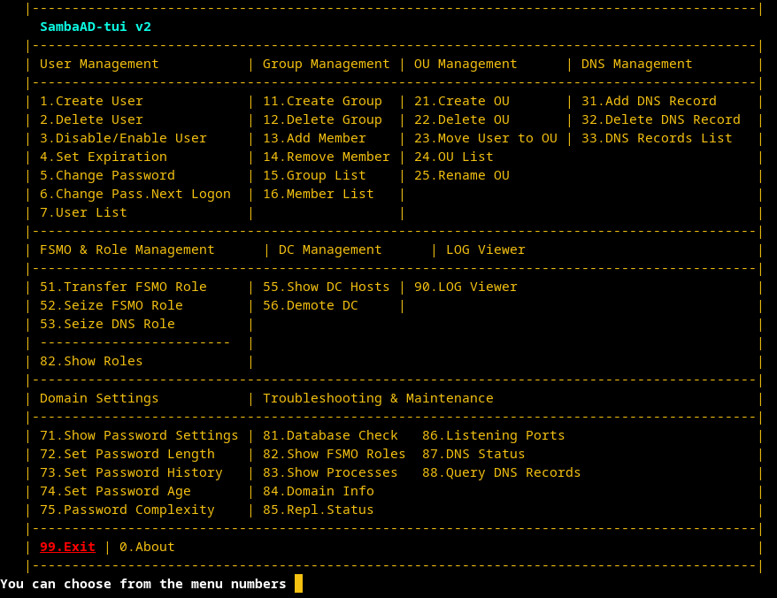

# Samba Active Directory -Text User Interface
Sambadtui, provides a Text User Interface for Samba Active Directory.
<br> This application in used on the Active Directory Server.

Sambadtui, does not install Active Directory. You can run on the existing installation. (e.g.DC1)<br>
[For a new Samba AD installation](https://github.com/eesmer/SambaAD-HelperScripts/blob/main/pages/SambaActiveDirectory-Installer.md)

You can look at the DebianDC repository for Active Directory setup and management via GUI.<br>
If you are interested in this topic; you can have a look at [DebianDC](https://github.com/eesmer/DebianDC)

## New
- A new script file has been created for version 3.
- Version 3 will produce fzf screens and report outputs.
- V2 will be available until version 3 is completed.

 to browse [SambAD-TUI v3](https://github.com/eesmer/sambad-tui/blob/master/sambadtui-v3.sh)

---

## Features
- User Management
- Group Management
- DNS Management
- FSMO and DNS Role Management
- DC Management
- Settings (password length,complexity,age)
- Maintenance and Troubleshooting

---

---

## Requirements
It works in Debian environment. Desktop environment is not required.

## Installation and Usage
```sh
wget https://raw.githubusercontent.com/eesmer/sambad-tui/master/sambadtui.sh
```
```sh
bash sambadtui.sh
```
Use sambadtui with root user
